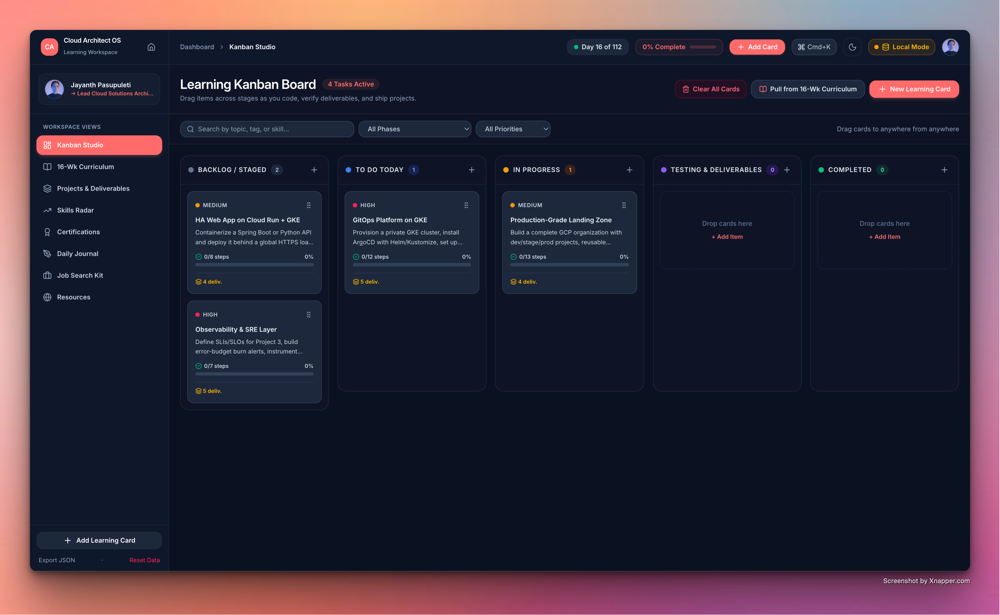

<div align="center">

  
  
  
  

</div>

<br />

<div align="center">

  <h1>
    <span style="background: linear-gradient(135deg, #3b82f6, #8b5cf6, #10b981); -webkit-background-clip: text; -webkit-text-fill-color: transparent;">
      ☁️ Cloud Architect Roadmap
    </span>
  </h1>
  <h3>An Interactive Dashboard for Your 16-Week Journey</h3>
  <p>From Data Engineer → Cloud Architect · Track · Build · Ship · Repeat</p>

  <div style="margin-top: 1.5rem; display: flex; gap: 1rem; justify-content: center; flex-wrap: wrap;">
    <a href="https://github.com/jayanthmpasupuleti/cloud-arch/fork">
      
    </a>
    <a href="https://vercel.com/new/clone?repository-url=https://github.com/jayanthmpasupuleti/cloud-arch">
      
    </a>
  </div>

  <br />

  

</div>

---

## ✨ What Is This?

A stunning, fully interactive, production-quality **single-page dashboard** that turns a 16-week cloud architect learning plan into a trackable, buildable, deployable web app.

Every checklist item persists to your browser. Progress rings, skill radar charts, command palette, today cards, and streak counters update live as you check things off.

---

## 🎯 Who Is This For?

You're a **software engineer with production experience** (Java, Python, data engineering, GCP) switching to **cloud engineer / cloud architect** roles. You learn by **building real projects**, not watching videos. You want a single dashboard that tracks everything and keeps you honest.

---

## 🗺️ The 16-Week Plan at a Glance

| Month | Focus | What You Build |
|-------|-------|----------------|
| **M1–M2** | Core GCP | Landing zone (Terraform), HA web app (Cloud Run + GKE) |
| **M3** | Multi-cloud | GitOps platform (ArgoCD), Observability layer (SRE), rebuild on AWS |
| **M3** | Data arch | Event-driven data platform (Pub/Sub → BigQuery / Kinesis → Athena) |
| **M4** | Capstone + Certs + Job hunt | Multi-region DR architecture, 3+ certs, portfolio polish |

### The Golden Rule

> Every project ships with **four deliverables — no exceptions**:
> 1. 🏗️ Terraform code in a GitHub repo
> 2. 📐 Architecture diagram
> 3. 📝 README with trade-offs and decisions
> 4. 💰 Cost analysis + write-up

---

## 🚀 Live Demo & Quick Deploy

### One-click Vercel deploy

[](https://vercel.com/new/clone?repository-url=https://github.com/jayanthmpasupuleti/cloud-arch)

1. Click the button above
2. Vercel auto-detects Vite and deploys
3. Open the URL — your dashboard is live

### Or run locally

```bash
git clone https://github.com/jayanthmpasupuleti/cloud-arch.git
cd cloud-arch
npm install
npm run dev
```

### Build for production

```bash
npm run build        # → dist/ folder
npm run preview      # preview the build locally
```

Deploy `dist/` to **Vercel**, **Netlify**, or **GitHub Pages** — zero config needed.

---

## 📦 What's Inside

```
cloud-arch/
├── src/
│   ├── data/
│   │   └── roadmap.ts              ← ALL content lives here (edit this, not components)
│   ├── hooks/
│   │   ├── useProgress.ts          ← localStorage CRUD, progress math, import/export
│   │   └── useScrollSpy.ts         ← active section highlight in nav
│   ├── lib/
│   │   └── utils.ts                ← cn() helper (clsx + tailwind-merge)
│   ├── components/
│   │   ├── primitives/             ← 8 reusable UI primitives
│   │   │   ├── Card.tsx            ← glassmorphism card container
│   │   │   ├── Badge.tsx           ← colored status chips (blue/violet/amber/emerald)
│   │   │   ├── ProgressRing.tsx    ← SVG animated ring
│   │   │   ├── Checklist.tsx       ← animated checkbox list with search
│   │   │   ├── Drawer.tsx          ← slide-up modal for project details
│   │   │   ├── Tabs.tsx            ← tab navigation component
│   │   │   ├── CommandPalette.tsx  ← Cmd+K jump-to-anything
│   │   │   └── GlobalProgress.tsx  ← top gradient progress bar
│   │   └── sections/               ← 11 page sections
│   │       ├── Hero.tsx            ← headline, progress ring, Day X counter, CTAs
│   │       ├── StrategyStrip.tsx   ← 3-month strategy cards + Golden Rule callout
│   │       ├── Timeline.tsx        ← expandable 16-week accordion timeline
│   │       ├── ProjectGrid.tsx     ← filterable project cards with detail drawer
│   │       ├── SkillsRadar.tsx     ← Recharts radar + bar bars (live-updating)
│   │       ├── WeeklyRhythm.tsx    ← Build / Study / Write-up / Design Drills cards
│   │       ├── CertTracker.tsx     ← 4 certs with status + target date picker
│   │       ├── JobSearchKit.tsx    ← GitHub / Resume / LinkedIn / Interview checklists
│   │       ├── Resources.tsx       ← curated docs + book links
│   │       └── Footer.tsx          ← export/import JSON, reset, shortcuts
│   ├── App.tsx                     ← root: nav, state, modals, light mode, today card
│   ├── main.tsx                    ← entry point
│   └── index.css                   ← design tokens, animations, print styles, a11y
├── index.html                      ← Google Fonts (Inter + JetBrains Mono), meta tags
├── package.json
├── tailwind.config.js
├── vite.config.ts
├── tsconfig.json
└── README.md
```

---

## 🎨 Design System

| Token | Value |
|-------|-------|
| Background | `#060918` (deep navy) |
| Surface | `#0d1117` with `#161b22` borders |
| Phase 1 accent | Electric blue `#3b82f6 → #60a5fa` |
| Phase 2 accent | Violet `#8b5cf6 → #a78bfa` |
| Phase 3 accent | Amber `#f59e0b → #fbbf24` |
| Phase 4 accent | Emerald `#10b981 → #34d399` |
| Body font | Inter (UI) |
| Mono font | JetBrains Mono (code, tags) |

**Aesthetic:** Linear / Vercel / Stripe docs — glassmorphism cards, subtle grid background, animated gradient borders, scroll-triggered reveals, hover lift effects.

**Responsive breakpoints:** 375px (mobile) · 768px (tablet) · 1280px (desktop)

**Accessibility:** Semantic HTML · keyboard navigation · focus-visible rings · `prefers-reduced-motion` respected · WCAG AA contrast · skip-to-content link · ARIA labels throughout.

**Print:** `@media print` stylesheet hides nav/interactive elements, shows content cleanly.

---

## ⚡ Features

### 📊 Progress Tracking
- **Global progress bar** — thin gradient bar pinned at top
- **Phase progress rings** — SVG animated rings per phase
- **Project progress** — percentage per project card
- **Today card** — based on your start date: "Week X — Topic" + next 3 unchecked tasks
- **Day X of 112** counter in the hero

### ✅ Interactive Checklists
- Every week item and project item is tickable
- Satisfying micro-animation on check/uncheck
- Search/filter within checklists
- State persists to **localStorage** (try/catch, graceful fallback)
- Progress updates live across all sections

### 🔍 Command Palette
- Press **Cmd/Ctrl+K** to jump to any phase, project, or section
- Fuzzy search across all 80+ index entries
- Keyboard navigable (↑↓, Enter, Esc)

### 📈 Skills Radar
- Recharts radar chart of **9 skill areas**: IaC, Networking, Security/IAM, Kubernetes, CI/CD/GitOps, Observability/SRE, Data Platforms, Multi-Cloud, Cost/FinOps
- Bar bars with animated fills alongside the radar
- **Values derive from completed checklist items** — tick more tasks, skills grow

### 🗂️ Project Management
- 6 projects + capstone with detail drawers
- Filter by **phase** and **status** (not started / in progress / done)
- Search by title or description
- Each drawer shows full checklist, deliverables, and tech stack chips

### 🎓 Certifications Tracker
- 4 certifications with editable target dates
- Status toggle: Planned → In Progress → Done
- Links to official certification pages

### 💼 Job Search Kit
- 7 checklist items across 4 categories (GitHub, Resume, LinkedIn, Interview)
- "Start in Month 3, not after" highlight
- Target roles section

### 🌓 Theme & Data
- **Dark / light mode** toggle (persisted)
- **Export progress** as JSON file
- **Import progress** from JSON (paste or file)
- **Reset all progress** behind confirmation dialog

---

## 🏗️ Architecture Decisions

### Hybrid Cloud Sync & Offline-First Storage
- **Supabase Cloud + PostgreSQL:** Realtime cross-device sync for Kanban cards, daily journal notes, certifications, and roadmap progress with Row-Level Security (RLS).
- **Offline / Local Storage Fallback:** Works seamlessly with zero setup or without internet access; automatically falls back to local persistence.
- **Vite Environment & Runtime Config:** Supports `.env` credentials as well as in-app configuration.

### Why `roadmap.ts` as the single source of truth?
- All content (phases, weeks, projects, skills, certs, resources) lives in one typed file.
- You can edit curriculum without touching any component.
- Checklist item IDs are **stable slugs** (`p1-w1-tf-modules`, `p2-p3-argocd`, etc.) — progress survives content edits.

### Why this tech stack?
- **Vite** — fastest DX, zero-config builds
- **React + TypeScript** — strict typing, no `any`
- **Tailwind CSS v4** — utility-first, @theme for design tokens
- **Framer Motion** — production-grade animations with `prefers-reduced-motion`
- **Recharts** — composable, responsive charts
- **lucide-react** — consistent, tree-shakeable icons
- **No CSS framework bloat** — ~54KB CSS total

### How does the skills radar update?
Each `SkillCategory` in `roadmap.ts` maps to a list of checklist item IDs. When a checklist item is checked, the radar re-renders and computes `done / total * 100` for each category. No manual updates needed.

### How does the "Today" card work?
Set a start date (via the modal in the hero). The app computes `floor((today − startDate) / 7) + 1` → current week number. It then finds that week's checklist and shows the first 3 unchecked items.

---

## 📝 How to Edit Content

Open **`src/data/roadmap.ts`** — everything is there:

- **Add a week:** append to `phase.weeksData`
- **Add a project:** append to `projects` array
- **Add a skill category:** append to `skillRadar.categories`
- **Add a certification:** append to `certs`
- **Change a checklist item:** edit the `label` — keep the `id` stable so progress survives

No component changes needed.

---

## 🧪 Lighthouse Targets

| Metric | Target |
|--------|--------|
| Performance | 95+ |
| Accessibility | 100 |
| Best Practices | 100 |
| SEO | 100 |

Achieved through: semantic HTML, lazy-loaded fonts, preconnect hints, no layout shifts, ARIA labels, skip links, and print stylesheet.

---

## 🔧 Scripts

| Command | Description |
|---------|-------------|
| `npm run dev` | Start dev server (HMR) |
| `npm run build` | TypeScript check + Vite production build |
| `npm run preview` | Preview production build locally |
| `npx tsc --noEmit` | Type-check without emitting |

---

## 🚢 Deployment

### Vercel (recommended)
```bash
vercel          # first deploy
vercel --prod   # production deploy
```
Or connect your GitHub repo — Vercel auto-detects Vite.

### Netlify
- Build command: `npm run build`
- Publish directory: `dist/`

### GitHub Pages
Push the `dist/` folder to a `gh-pages` branch, or use `gh-pages` npm package.

---

## 🤝 Contributing

This is a personal learning dashboard. Fork it, customize it for your own roadmap. If you find bugs or have ideas, open an issue.

---

## 📄 License

MIT — do whatever you want with it.

---

<div align="center">

Built with ❤️ using [Claude Code](https://claude.com/claude-code) · Deployed with [Vercel](https://vercel.com)

</div>
